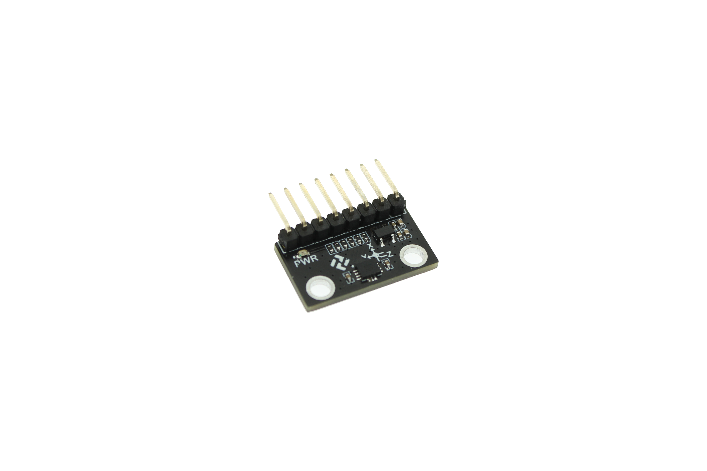
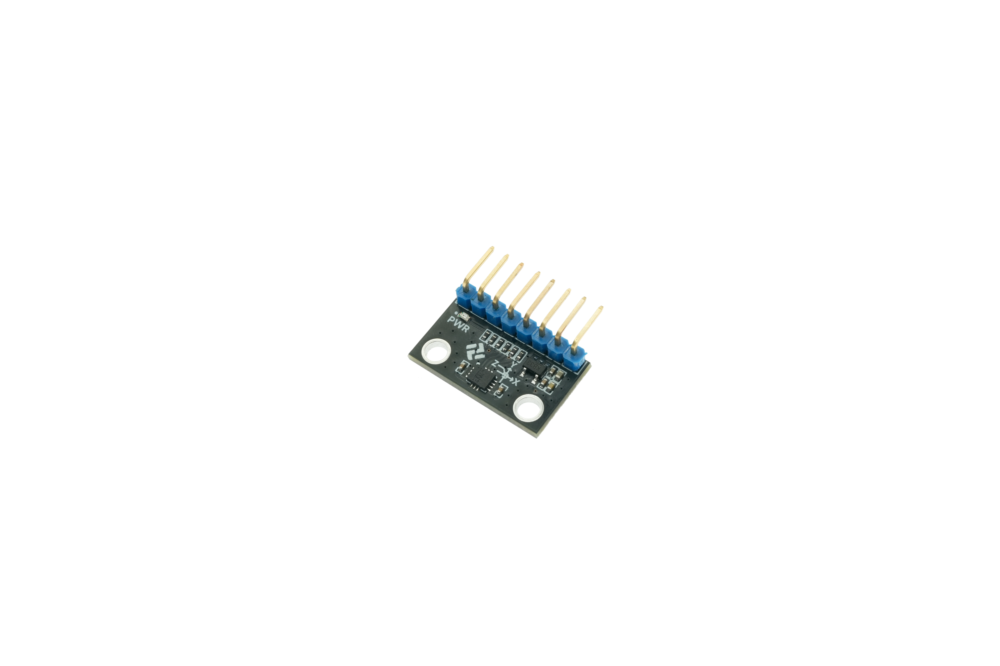
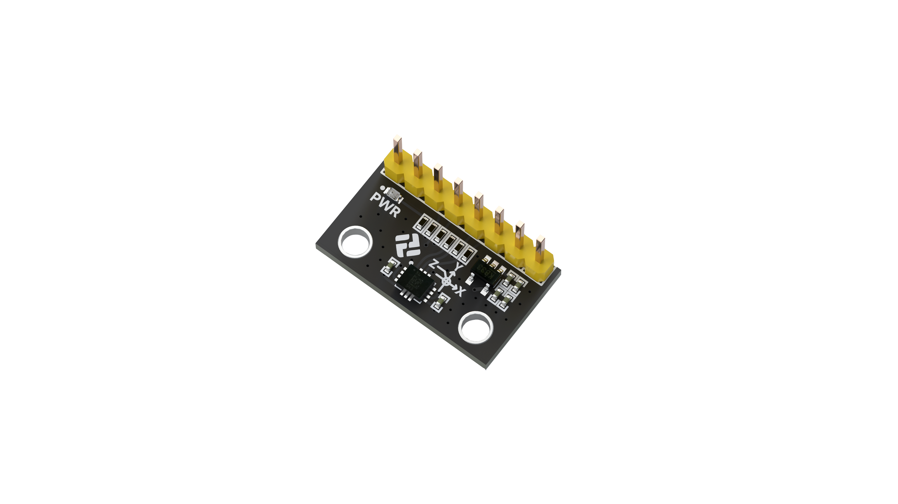

# 逐飞科技IMU660RX资料

#### 介绍
逐飞科技针对需要使用姿态传感器的应用场景，精心制作了不同型号的6轴传感器，所使用的芯片有博世BMI270、意法半导体LSM6DSRTR、意法半导体LSM6DSV16XTR。

#### 学习套件
IMU660RA六轴:[点击此处购买](https://item.taobao.com/item.htm?id=692528672403&pisk=gvBsxicOtV0stSzctNqeAKuiX_JflkyzcmtAqiHZDdp9kx_PSs-4jlfBDZ73mlvNDE_f8eDN_5A2lmTCWxRNhiDXDiQ0jErgTGjMnKUzzKwPjGc40yKACFHK9MxyXhFe68__sB4zz8yb6Dpb5z7NZ7CqJ3tJHhdvXHEB0hTvHfHTAeKXqEHOkZILAntq6fK9M2Kp0npxMfdxpBKM4VKvkKLLAnYpkKpAkphFyvtY13I_XoEubwhQRGTIHxBBvrYRfttHY91W6UdpRxEFdhO6yGBMVUdwv9WBaBo4ypIlTNKBF-MpCQ1O5HI3lYTOagjykCntBMv6RBLGAVh9VdT6wOdgUxJMM66BQOUmZMSBWQ9FTW4wgd_1ZUATtybfAF7ACB3_8E5PYOdCyykCoI1O5HpR46HyP70-GDOohHTzAkGmi9u-GiQndtqJ6Hx_zkZISjA9xHtTAkGDQCKHfzqQAbVG.&spm=a1z10.3-c-s.w4002-22508770840.10.2f2749cc2WswaA)。

IMU660RB六轴:[点击此处购买](https://item.taobao.com/item.htm?id=895482017406&pisk=g8ymxLvydSlf4yBhhUMf9lzDym1RGxMsJPptWA3Na4uWHSIbkCcaJycwBsMxsA4ry-3YDxuwIPETHPEaBcyih8FvBqQjIlzKIwQdp9EbcfMNJwhSTylrLDv27FnZUbktjulpKtqbcAgw2F5LaoTMndpeucuNqYoixdkZgIrPqmnmQKlw3uurP4uZQflwULoKXEJZgASk4mnHQFlZQY8rAcRZQAza4gmszmlXUnuUQ5yPzr01FoyJq8imi2rquoEYUNc2Go3kzU2uZj0Ep4vwQ8m0VC40Dpft8Wgx94UPeKDg4c4nxrYPrAruhJcz3a9iNP0ra-lWbpr3k-Dz3WxwQuDmPPnzlEbo8-ZzdYlRLMqzFrEbElKNQ0UKzowqI9SInxuqE0wOPKuga5yxGATVoArobgS2aBoTUdiPX8R61joSq2LjbLsDH_2uKgjkO5GqVD0dqgA6jjoSqTslqBNtg0imw&spm=a1z10.3-c-s.w4002-22508770840.12.2f2749cc2WswaA)。

IMU660RC六轴:[点击此处购买](https://item.taobao.com/item.htm?abbucket=6&id=1026243801017)。

#### IMU660RA

#### IMU660RB

#### IMU660RC

#### 基础参数

1. **产品型号**：六轴加速度计陀螺仪IMU660RX
2. **芯片型号**：IMU660RA（BMI270）；IMU660RB（LSM6DSRTR）; IMU660RC（LSM6DSV16XTR）
3. **产品颜色**：黑白色系
4. **产品重量**：约1.6g
5. **供电电源**：3.3V-5V(自带LDO稳压芯片)
6. **通信方式**：支持I1C和SPI(硬件SPI可达10M波特率)
7. **陀螺仪范围**：士125DPS、士250DPS、士500DPS、士1000DPS、士2000DPS、士4000DPS（仅IMU660RC支持）
8. **加速度范围**：士2G、士4G、士8G、士16G

#### 传感器优势

该模块属于新一代的传感器，陀螺仪零偏和温漂小于ICM20602，该模块使用硬件SPI可以达到10M速率，**IMU660RC模块支持直接输出四元数姿态信息**，例程提供四元数换欧拉角例程。
